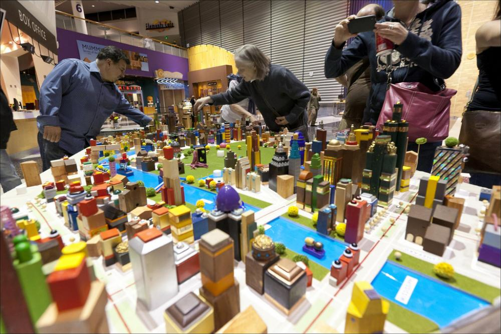
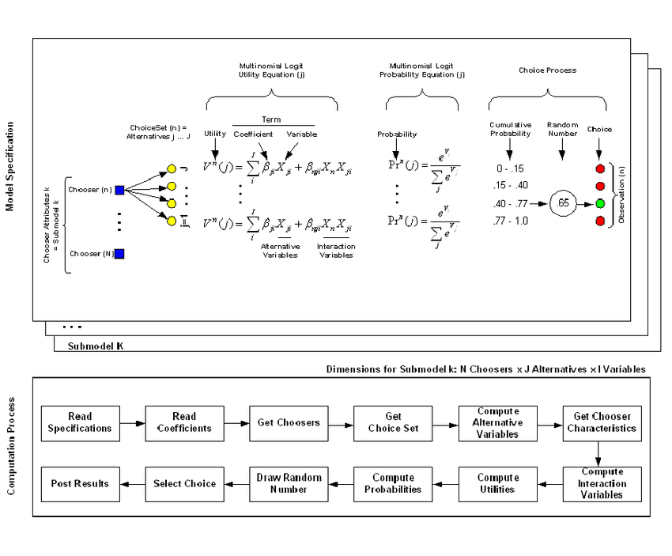
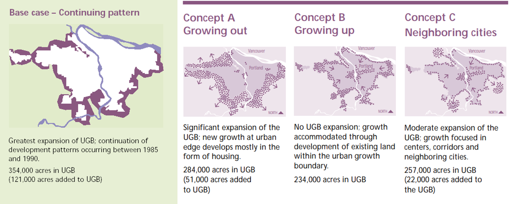
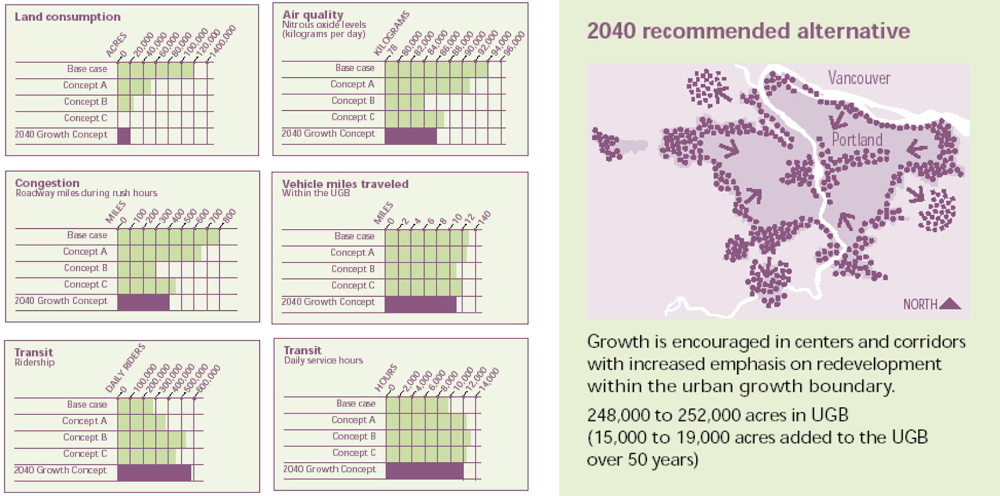
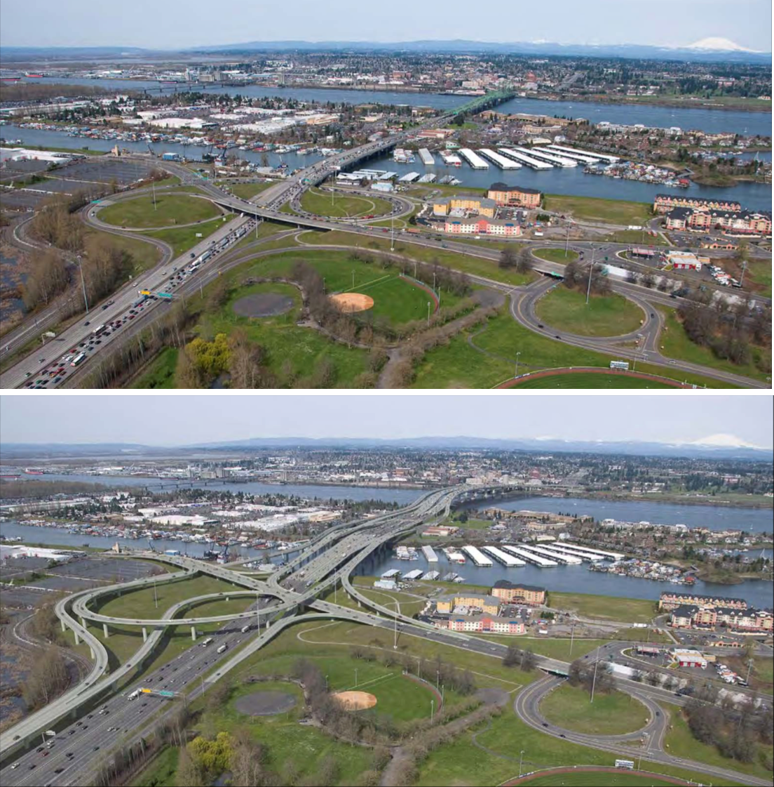
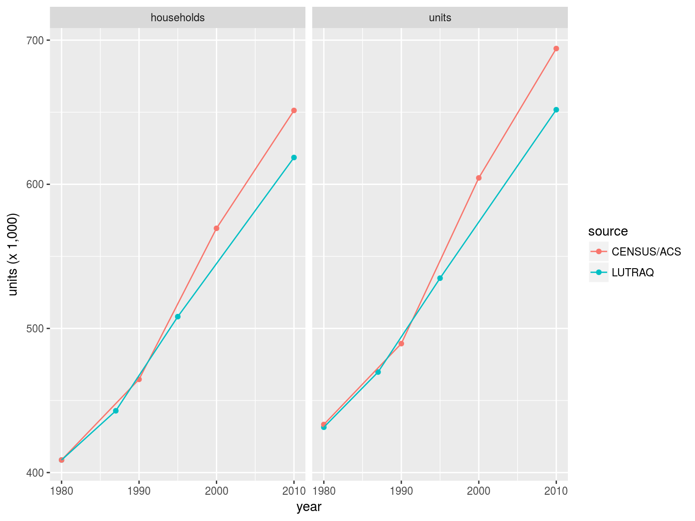

```{r setup, include=FALSE}
#knitr::opts_knit$set(root.dir = "../")
knitr::opts_chunk$set(message=FALSE, warning=F, echo=F, fig.align="center")
options(width = 2000)
options(repos="https://cran.rstudio.com")
```

# Projecting the Future for Planning

By definition, planning projects the future. Because researchers & planners don't have a crystal ball to help them, there are a few second-best options in urban and transportation planning:

- Widsom of the crowd - Visioning
- Widsom of experts - Delphi methods
- Widsom of data & computers - Modeling

---

# Visioning vs Land Use Models

.pull-left[
- **Visioning** is a community-oriented planning technique used to identify regional land-use and transportation goals
- **Objectives**: Consensus-building of the region's future;
- **Tools**: Sketch planning tools (Envision Tomorrow+, CommunityViz, ...), paper/tablet maps, lego bricks
- Primarily driven by user-controlled inputs;
- Limited by the quality of the public involvement and consensus-building, the feasibility of the preferred scenario
]

.pull-right[

Credit: [City of Milwaukie, OR](https://www.milwaukieoregon.gov/planning/visioning-place-it) 
]

---

# Visioning vs Land Use Models

.pull-left[
- **Land-Use Models** predict a region’s future spatial distribution of households and employment 
- **Objectives**: anticipating direct and indirect impacts of policies/planns/public investment
- **Tools**: UrbanSim, DRAM/EPAL, MetroScope, CubeLand, ...
- Primarily driven by base year conditions, available data, scenario inputs, and model assumptions
- Limited by the quality of data inputs and model assumptions
]

.pull-right[

Source: [Waddell, 2005](https://www.researchgate.net/publication/228740459_Confronting_the_bane_of_endogeneity_in_modelling_urban_social_dynamics)
]

---

background-image: url("resources/Waddell2011.jpeg")
background-size: 75%
class: center, bottom

Computer Models in Plan and Policy-making Process (Source: [Waddell, 2011](http://www.tandfonline.com/doi/abs/10.1080/01441647.2010.525671))

---

background-image: url("resources/LUM_evolution.png")
background-size: 100%
class: center, bottom

Evolution of Land Use Models

---

background-image: url("resources/LUTM_trends.png")
background-size: 80%
class: center, bottom

Evolution of Land Use and Transportation Models (Source: [Hunt et al, 2005](http://www.tandfonline.com/doi/abs/10.1080/0144164052000336470))

---

background-image: url("resources/fampo_lu.png")
background-size: 100%
class: center, bottom

Status of Land Use Model Applications

---

background-image: url("resources/mag-lu.png")
background-size: 100%
class: center, bottom

Status of Land Use Model Applications

---

background-image: url("resources/fampo-tdm.png")
background-size: 100%
class: center, bottom

Status of Travel Demand Model Applications

---

background-image: url("resources/psrc_integrated_process2.png")
background-size: 100%
class: center, bottom

Connect Visioning and Land Use Modeling (Puget Sound Regional Council)

---

# Metro's Objectives of Applying Land Use Models

> Metro is responsible for **growth planning under Oregon law** and **transportation planning under federal law** for three urban counties in the Portland region.  Analytic support for those two processes requires forecasts of how much growth is likely to occur within the region’s Urban Growth Boundary (UGB) and where such growth is likely to occur at smaller-scale geographies.  The small-geography growth forecasts support transportation planning as inputs to transportation system performance forecasting. 

---

background-image: url("resources/MetroScope_components.png")
background-size: 100%
class: center, bottom

MetroScope Model Structure

---

background-image: url("resources/metro_pop2035.png")
background-size: 90%
class: center, bottom

Population trend and forecasts

---

background-image: url("resources/metro_emp2035.png")
background-size: 90%
class: center, bottom

Employment trend and forecasts

---

background-image: url("resources/MetroScope_modules.png")
background-size: 90%
class: center, bottom

Residential modules of MetroScope

---

background-image: url("resources/MetroScope_geographies.png")
background-size: 80%
class: center, bottom

MetroScope Geographies

---

# Metro's 2040 Growth Concept

```{r, out.height = "400px"}

```

---

# Metro's 2040 Growth Concept

```{r, out.height = "400px"}

```

---

# Application: Columbia River Crossing

```{r, out.height = "500px", out.width="800px"}

```

---

background-image: url("resources/CRC_VMT.png")
background-size: 72%
class: center, bottom

Columbia River Crossing Study with MetroScope (Source: [Sonny Conder, et al, 2010](http://www.oregonmetro.gov/sites/default/files/10272010_CRC_economic_impacts_tolling.pdf))

---

background-image: url("resources/CRC_density.png")
background-size: 72%
class: center, bottom

Columbia River Crossing Study with MetroScope (Source: [Sonny Conder, et al, 2010](http://www.oregonmetro.gov/sites/default/files/10272010_CRC_economic_impacts_tolling.pdf))

---

# How good/bad are the forecasts

Households & Housing Predictions (LUTRAQ) vs Observation (CENSUS/ACS)

```{r, out.height = "400px"}

```

- [A post-mortem analysis of the Land-Use-Transportation-Air-Quality (LUTRAQ) forecasts](https://sapporo.usp.pdx.edu/rstudio/files/LUTRAQ/docs/ACSP_LUTRAQ_slides.html)

---

# Opportunities in Land Use Modeling

- Big data: diverse data sources available for model estimation and prediction
- Machine learning: powerful non-statistical algorithms for more accurate predictions
- Making sense of and communicate large volume of modeling outputs
- Uncertainty in model inputs and outputs